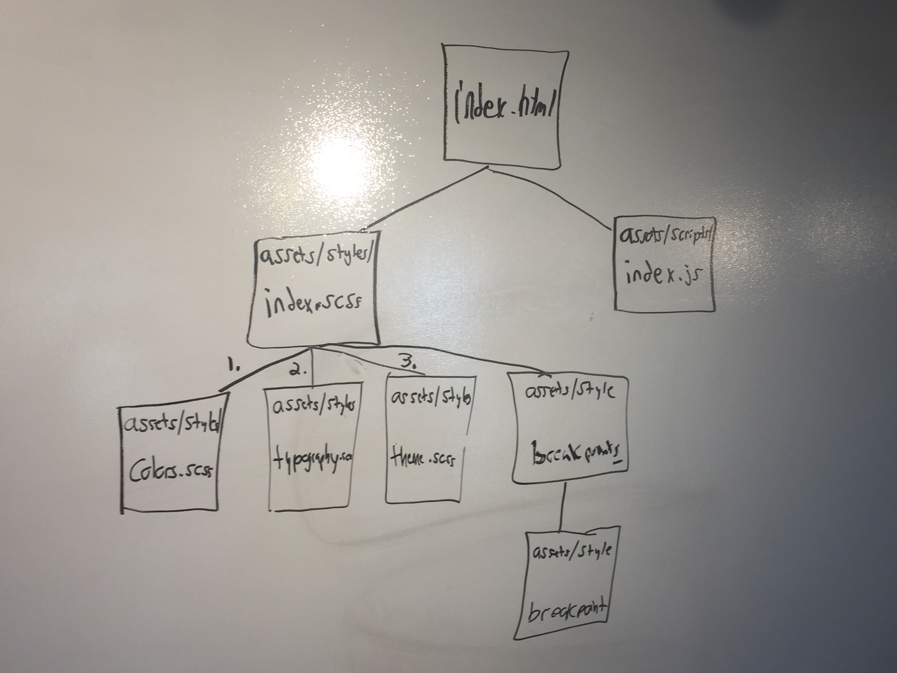

## Nested Slectors



```scss
section.intro
```
- selects all `sections` with the class `intro`

```scss
section.intro > h1
```
- selects all `h1` elements whos parent is a `section` with the class `intro`
  - descendants
  - children, grandchildren, etc

  ```scss
  section.intro
  ```
  - selects all `sections` with the class `intro`

```scss
section.intro > h1:hover
```
- selects all `hovered` `h1` elements whos parent is a `section` with the class `intro`
  - descendants
  - children, grandchildren, etc

```scss
section.intro > ul
```
- selects all `ul` elements whos parent is a `section` with the class `intro`
  - descendants
  - children

```scss
section.intro > ul li
```
- selects all `li` elements inside `ul` elements whos parent is a `section` with the class `intro`
  - descendants
  - children, grandchildren, etc

```scss
div, p
```
- selects all `div` and `p` elements

```scss
div p
```
- selects all `p` elements inside `div` elements
  - descendants

```scss
div + p
```
- selects all `p` elements that are placed immediately after `div` elements
  - siblings

The `&` always refers to the parent selector when nesting.
```scss
.some-class {
  &.another-class {}
}
```
becomes
```css
.some-class.another-class {}
```

- sassmeister.com to see how the `scss` compiles to `css`
- Questions on the ampersand
  - https://css-tricks.com/the-sass-ampersand/


## Semantic Color Names and Theming
- Why Themes?
  - Maybe you work for a dev shop that re-uses different themes for different clients.
  - if we’re working for a company and they have strict colors and typography rules that we have to work by
- Only immport modules once.
  - *ORDER OF IMPORT MATTERS*
    - **cascading stylesheet**


## Use a Custom function
- benefit of using mix rather than `darken` or `lighten`: it will progressively go to black (or white) as you decrease the proportion of the color, whereas darken and lighten will quickly blow out a color all the way to black or white.
  - ie: it fades more smoothly


## Sass Mixins
- Questions on mixins
  - https://scotch.io/tutorials/how-to-use-sass-mixins


## Best Practices
- don't repeat yourself (DRY)
  - aimed at reducing repetition of all kinds.
- `class` over `ID`
  - The element is not re-usable on that page
    - There can only be one instance on the page. There's no way to re-use it.
      - One line of css that’s only usable once is not a good value.
    - The cascade: (anything further down the css, can overwrite the previous css rules)
      - only way to override this is to add more weight
        - ie: `!important`
    - https://screwlewse.com/2010/07/dont-use-id-selectors-in-css/
